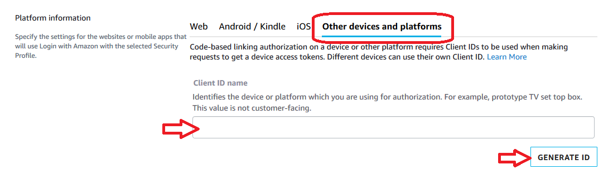
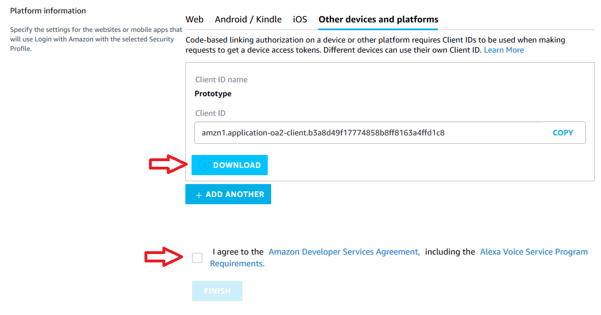

# Amazon Voice Service SDK Setup.

1. [Description](#description)
2. [Register device and profile](#avs-reg)
3. [Configuration of Amazon Voice Service in Firmware](#avs-config)
4. [First run and test](#avs-first-run)


## <a name="description"></a> Description.
In order to work with `avs-device-sdk` you need to compile one variant of 
amazon-voice-servce firmware. While doing this you need to register on
main Amazon Developer portal in order to add device in their system.
After firmware is flashed on board you'll need to initiate `SampleAPP` or your
application with proper configuration and proceed with standart steps of 
Authorization.

By default this firmware provides `SampleAPP` and all necessary libraries 
from `avs-device-sdk`. Configuration in firmware is stored in `/etc/alexa/`
 directory.

All of this is described in next chapters.


## <a name="avs-reg"></a> Register device and profile.
This is part of official documentation from 
[Amazon Developer site - Prototyping - Register a product]
(https://developer.amazon.com/en-US/docs/alexa/alexa-voice-service/register-a-product.html).

#### I. Create an Amazon developer account

 Create a free developer account at [developer.amazon.com](developer.amazon.com). 
If you already have an account, you can skip this step.

#### II. Create a product

 After you've created an Amazon developer account, 
you create a product and security profile. 
This authenticates your software client so it can connect to AVS.

 To create a product:

1. Log in to the 
[AVS dashboard](https://developer.amazon.com/avs/home.html#/avs/home).
    
If this is your first time registering a product, you see a welcome screen. 
    Click `GET STARTED`.

2. Click `PRODUCTS`.
3. Click `ADD NEW PRODUCT`.

#### III. Fill in product information
You now must fill in your product information. 
This information identifies your device with AVS.

To fill in your product information:

1. Choose a `Product Name`. For example, `AVS Tutorials Project`.
2. Choose a `Product ID`. For example, `PrototypeIMX6ULL`. 

Don't use any spaces in your product name.

3. In the `Please Select Your Product Type` dropdown, 
select `Device with Alexa built-in`.
4. For `Will your device use a companion app?`, choose `No`.
5. In the `Product Category` dropdown, select `Other (please specify)`.
6. Write a meaningful description in the `Brief product description box`. 
For example, `Prototype`.
7. Under `How will users interact with your product?`, select `Hands-free`.
8. Skip the `Upload an image step`. This isn't required for prototyping.
9. Under `Do you intend to distribute this product commercially?`, select `No`.
10. Under `Will your device be used for Alexa for Business?`, select `No`.
11. Under `Is this device associated with one or more AWS IoT Core Accounts?`, 
select `No`.
12. Under `Is this a children’s product or is it otherwise directed to children 
younger than 13 years old?`, Select `No`.
13. Click `NEXT`.

#### IV. Set up your AVS security profile.
A login with Amazon (LWA) security profile associates your security 
credentials with your product.

To set up your security profile:

1. Click `CREATE NEW PROFILE`.
2. Under `Security Profile Name`, enter a relevant name. 
For example, `AVS Tutorials Project`.
3. Under `Security Profile Description`, enter a relevant description.
For example, `AVS Tutorials`
4. Click `NEXT`. Your `Security Profile ID` generates.
5. Select the `Other devices and platforms` tab.
6. Under `Client ID name`, enter a relevant name. For example, `Prototype`.
7. Click `Generate ID`.
8. Click `Download`. This downloads your config.json file that contains 
your AVS credentials. Save the file to your home directory directory. 
This file will be needed in next chapter.
9. Read the Amazon terms and conditions. If you agree, check the `I agree 
to the AVS agreement and the AVS Program Requirements` box.
10. Click `FINISH`. Congratulations! You now have access to AVS.
11. A pop-up appears. Click `OK`. 
You can now view your device on your
[AVS dashboard](https://developer.amazon.com/avs/home.html#/avs/homes).

The following screenshots highlight the important steps described in the previous section.





## <a name="avs-config"></a> Configuration of Amazon Voice Service in Firmware.

When firmware is compiled and flashed on board you'll need `clientID` and `productID`
from previously downloaded from AVS dashboard `config.json` file.
You need to copy them into `/etc/alexa/AlexaClientSDKConfig.json` file in section 
`deviceInfo`. Also you'll need to fill `deviceSerialNumber`, `manufacturerName`
and `description` with your information in that file.

Be aware, that 'clientID` and `productID` is generated by AVS and used for authorization.

For example, section of `AlexaClientSDKConfig.json` will be:

```
    "deviceInfo":{
        // Unique device serial number. e.g. 123456
        "deviceSerialNumber":"123456",
        // The Client ID of the Product from developer.amazon.com
        "clientId":"at5544",
        // Product ID from developer.amazon.com
        "productId":"amzn1.application-oa2-client.ec4582853953483a89fdade69f066cb18",
        // The name of the device manufacturer.
        "manufacturerName": "Temp",
        // The description of the device which should contain the manufacturer name or how the device is connected.
        "description": "Temporary test device for compatibility checks."
    },
```

## <a name="avs-first-run"></a> First run and test.

On first run `SampleApp` will ask you to enter PIN on AVS website.
To run `SampleApp` in firmware type in console

> SampleApp /etc/alexa/AlexaClientSDKConfig.json

On first run you'll see message like this:

```
 ##################################
 #       NOT YET AUTHORIZED       #
 ##################################
 ################################################################################################
 #       To authorize, browse to: 'https://amazon.com/us/code' and enter  the code: {XXXX}       #
 ################################################################################################
```

You'll need to login to AVS and input XXXX code. After this `SampleApp` will 
automatically switch to Authorized state and you can test AVS. 

`SampleApp` does not support keyword/hotword activation, so you'll need to activate 
service manually. To do this just type `t` and Enter, after that Alexa will 
switch to Listening state and you can say "Tell me a joke" or 
"Pick a number between zero and ten" in microphone. In first case Alexa will
tell you joke, in second it'll say random number between 0 and 10.
To exit application use `Ctrl+C` combination.