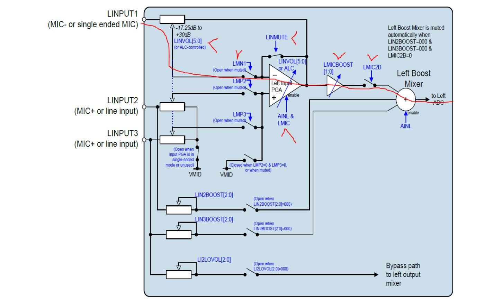

[Back to Main Readme](../README.md)

#### Speaker 


To initialize:
```
amixer set 'Left Output Mixer PCM' on
amixer set 'Right Output Mixer PCM' on
amixer set 'Headphone' 80%
```

To play:
```
aplay /tmp/sample.wav
```

#### Microphone



To initialize:
```
amixer set 'Capture' 100%
amixer set 'ADC PCM' 100%
amixer set 'Left Input Boost Mixer LINPUT1' 100%
amixer set 'Right Input Boost Mixer RINPUT1' 100%
amixer set 'Left Input Mixer Boost' on
amixer set 'Right Input Mixer Boost' on
```
additionally you need to enable PGA by disabling LINMUT/RINMUTE using `i2c-tools`:
```
i2cset -f -y 0 0x1a 0x01 0x0f
i2cset -f -y 0 0x1a 0x03 0x0f
i2cset -f -y 0 0x1a 0x12 0x40
i2cset -f -y 0 0x1a 0x30 0x04
```
here 0x1a is IC address on I2C bus. Last two bytes are register address and it's value.
To get register address you have to shift it to 1 bit, e.g. here registers R0, R1, R9 and R24 written.

To-Do: omit using `i2c-tools` by modification wm8960's driver to support that commands.

To record:
```
arecord -f S32_LE -r 48000 -c2 -D hw:0,0 -d 10 /tmp/2.wav
```