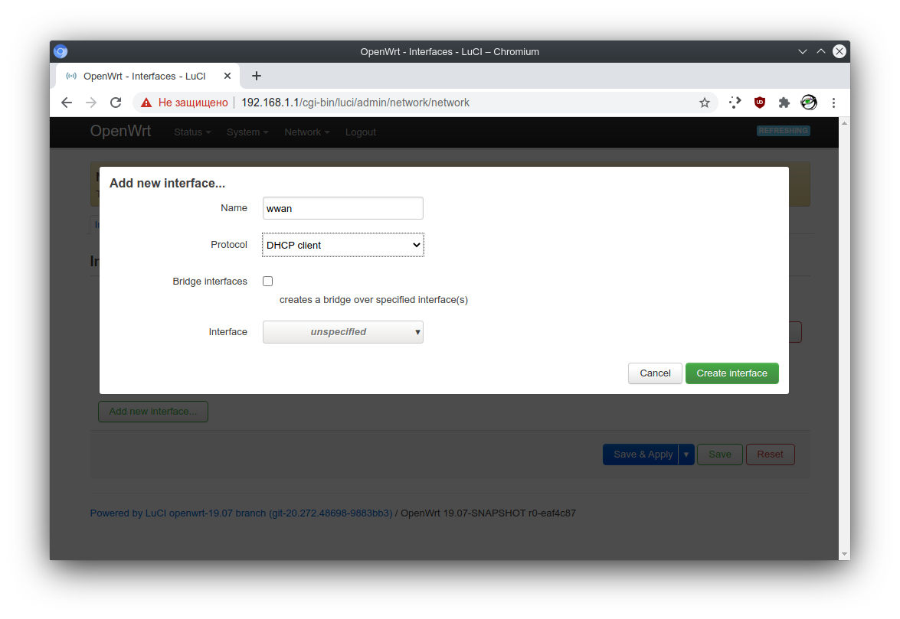
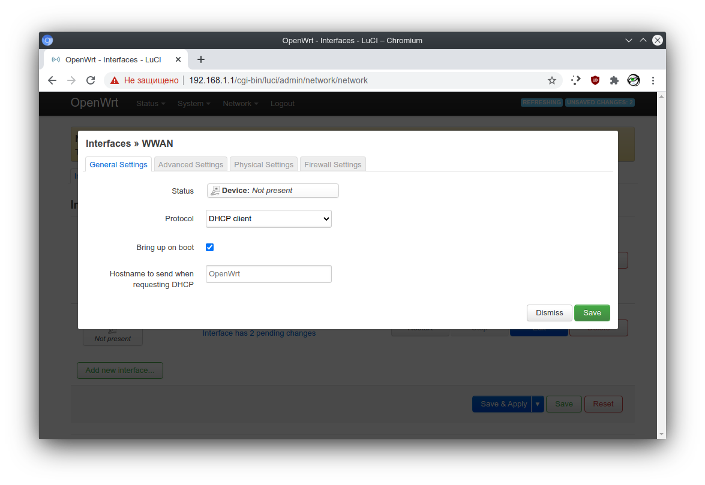
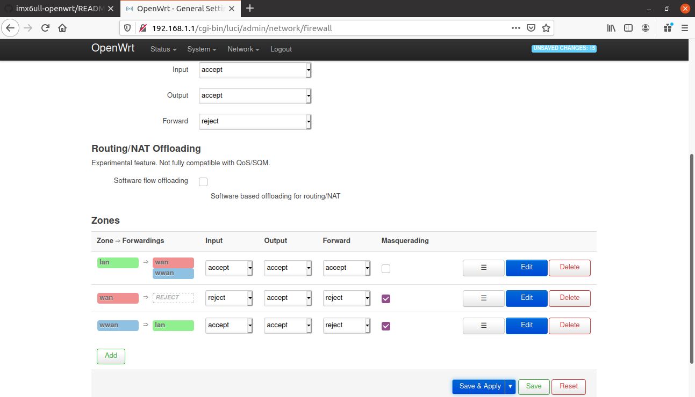
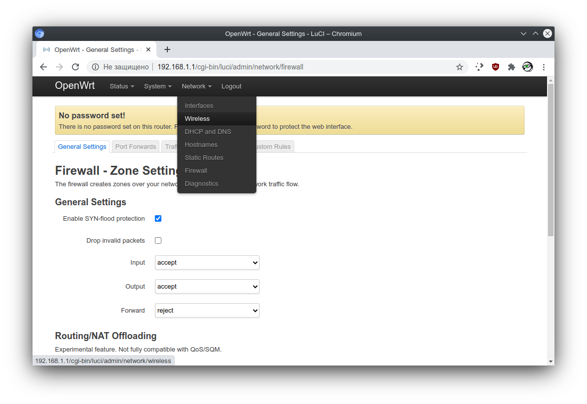
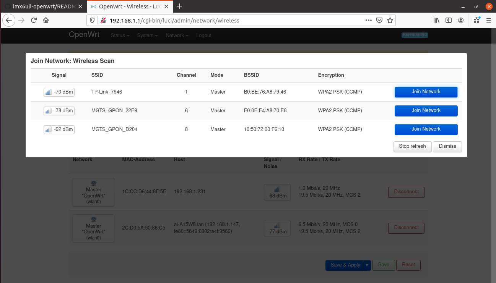
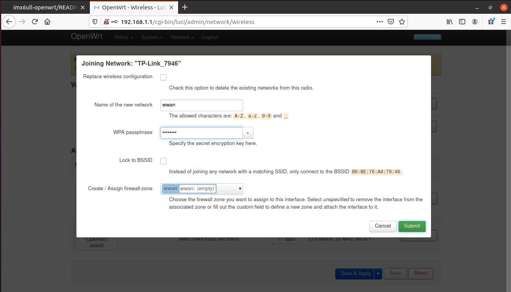
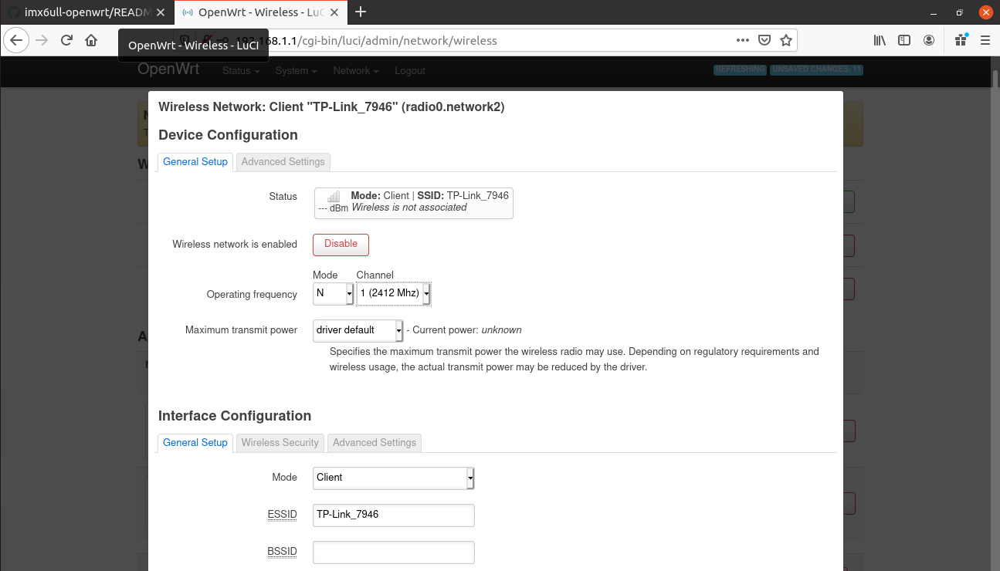
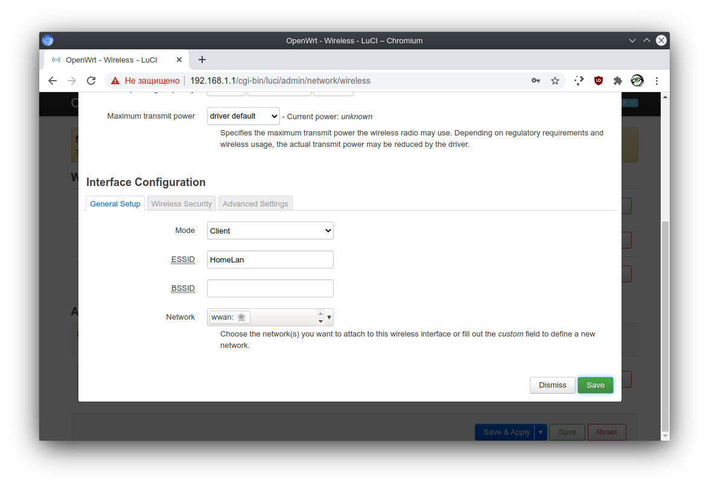
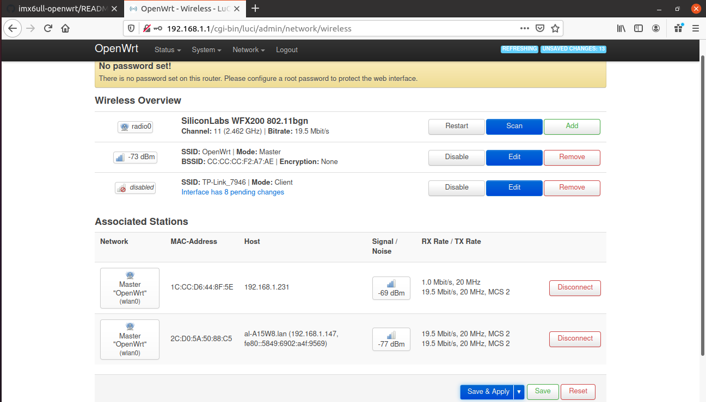

[Back to Main Readme](../README.md)

# WiFi DualStack setup (AP+STA) LuCi (Web-interface)

In this document we'll describe how to setup second virtual 
wireless interface with LuCi (web-interface) to connect to 
upstream wireless network and work as simple repeater in router mode.

Main disadvantage of this setup is speed drop twice to end client 
connected to our AP wireless virtual interface.
Also AP interface will not be available until sta interface is connected
to uplink (for now, will be resolved with fallback daemon). This is due to
impossibility of virtual interfaces
to work on different channels simultaneously, so physical interface must first
acquire channel number after connecting station, so AP interface will also
work on same channel.

## Terminology
***PHY*** - physical interface not showed in network interfaces but can be 
shown by `iw list` command with all information about interface available.

***VIF*** - virtual interface, that is presented in system as wlan* network
interfaces. There can be several *vifs* for each *phy* interface.

***radio*** - just *phy* interface name in terms of openwrt naming scheme.

## Setup

**1.** Login to web-page of device using it's IP address (default 192.168.1.1).
Username is `root` password by default is blank, so leave it empty.

**2.** Navigate to network interfaces page with menu on top of page.

3. Push `Add new interface...` button.

**4.1** Here we add our outgoing network interface with name `wwan` and DHCP-client.
After finished just push `Create interface` button.

**WARNING!** Don't enable bridge on this interface as station *vif* cannot be 
added to bridge.

**4.2** On next screen just Press `Save`

**5.** Navigate to firewall configuration with menu on top of page.

**6.** Push `Add` button to add new firewall zone.

**7.** On this page we creating new firewall zone for our station named `wwan`. 
Be sure, that `Input` set to `accept` and `Masquerading` is enabled for outgoing 
traffic. We doing `accept` on `Input` to make configuration available (LuCi/telnet)
from our uplink network.

Here we set `Covered networks` to our previously created interface `wwan`
and enable forwarding with `lan` zone to enable access to uplink for our 
own stations connected to our AP *vif*.

After finished push `Save` button.

**8.** Here push `Save & Apply` button to save network and firewall configuration
at once.

**9.** Navigate to Wireless configuration with menu on top of page.

**10.** In order to add new station *vif* push `Scan` button on first row middle cell
describing *phy/radio* interface.

**11.** In openned window you will see scan results. Here you have to remember
`channel` of your uplink network (in this case it is 1) 
and can select it by pressing `Join Network` button.

**12.** In this window you need to setup WPA/WPA2 encryption key of your uplink netowrk
and Assign previously created `wwan` firewall zone. Name of the network should be
`wwan`. At the end push `Submit` button.

**13.** In this window you only need to setup proper channel number from step **11**.
In this example we set channel `1`.

**14.** Scroll down and press `Save` button.

**15.** At the end just push `Save & Apply` button athe bottom of main page.

After parameters is applied everything should work fine. 
AP interface will go up after station interface successfully connects to uplink.

