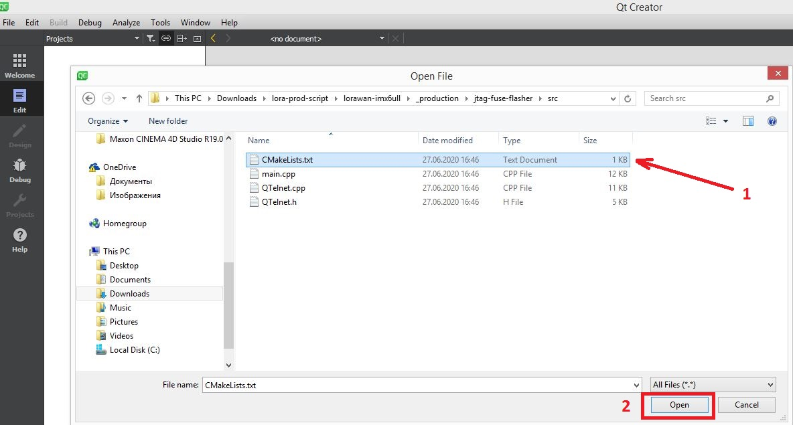
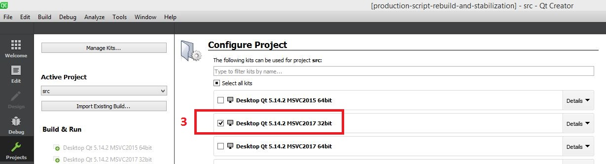
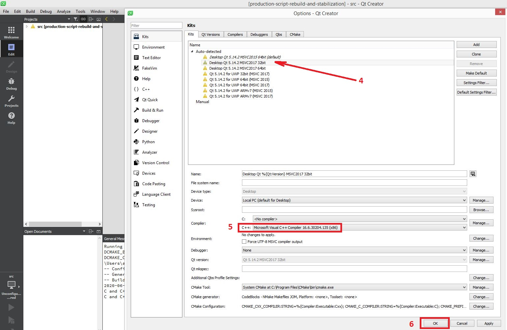
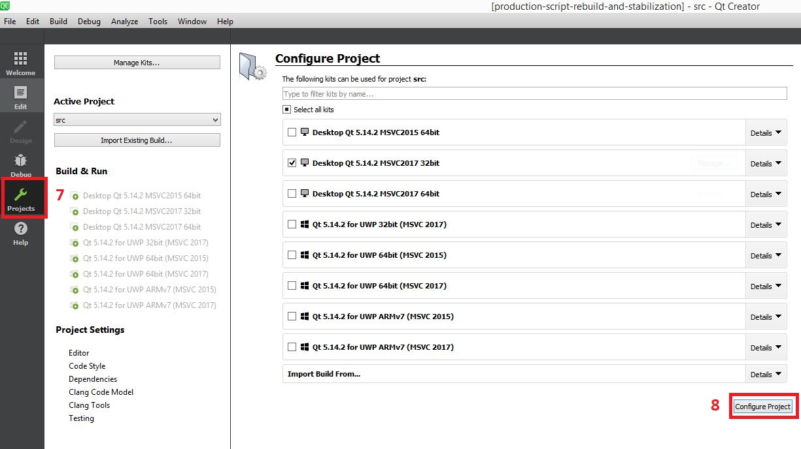
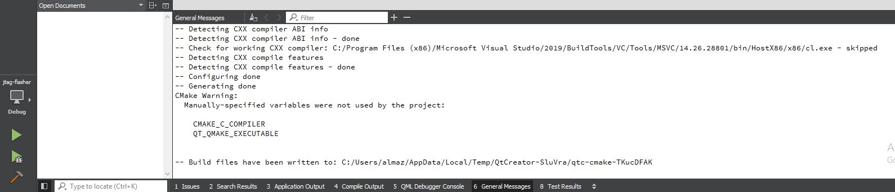
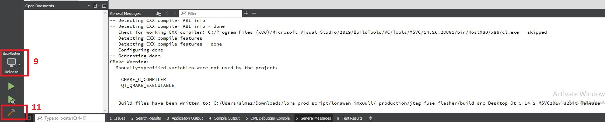

#####  INFO

This program is ment to automate flashing process of i.mx6ull boards with ECSPI3 used to boot.

jtag-flasher makes it possible through several steps:
1. Run OpenOCD
2. Reset board
3.1  Download UBoot image to RAM using JTAG
3.2  If factory firmware file provided its image will be downloaded to RAM using JTAG
4. Run UBoot
5. Interrupt UBoot loading process.
5.1 If factory firmware file provided its image will be burned to flash from RAM using UBoot facilities.
6. Burn FUSE bits to set automatic load from ECSPI3.
7. Burn FUSE bit BT_FUSE_SEL indicating that i.mx6ull internal ROM boot will use fuses to select boot device.
8. Reset board, which will lead to board restart and normal firmware loading from flash.

Directories here:

* `./src/` - Keeps sources for program

* `./release/` - Keeps prebuilt libraries, executables and configuration files.

* `./packages/` - Keeps programs used for preliminary setup and openocd for windows.

`u-boot.imx` file can be obtained directly from uboot build directory while building firmware file,
it can be found in `build_dir/target-arm_cortex-a7+neon-vfpv4_musl_eabi/u-boot-wirelessroad_ecspi3/u-boot-2017.07/`

#####  PREREQUISITES

 You'll need serial interface connected to board, JLink JTAG interface connected to board 
to properly flash firmware and burn fuses for autoboot process of board.
jtag-flasher uses OpenOCD to accomplish process. OpenOCD can use JLink adapter only with
WinUSB driver installed. You can switch driver using ZADIG utility in './packages/' directory.
If you need to switch JLink driver back, just update driver manually in Device Manager,
selecting 'JLink device' instead of 'JLink'.

#####  HOWTO use 

 Open command line (cmd), change directory to './release/'.
In Device Manager find proper serial interface name to use (for example, COM6).
If you also need to flash factory firmware to board, put its file to './release/' directory.
In this example factory firmware file will be 'openwrt-imx6ull-cortexa7-lorawan_gateway_ethernet-squashfs.mtd-factory.bin'
jtag-flasher has default values for most options. If not set will be used 'u-boot.imx' filename for uboot to RAM loading.
If not set, will be used 3000 telnet port to connect to OpenOCD, which is set in openocd.cfg configuration file.

 Run jtag-flasher in command line like this:
jtag-flasher.exe -s COM6 -f openwrt-imx6ull-cortexa7-lorawan_gateway_ethernet-squashfs.mtd-factory.bin

 Without factory firmware file selected jtag-flasher will only load uboot to RAM and burn fuses leaving flash on ECSPI3 untouched.

#####  BUILD
 
To build jtag-flasher from sources you'll need 'Qt 5.14.2' package and 'CMake 3.17.2' installed on your PC.
After installing Qt and CMake, open jtag-flasher project with QtCreator and build jtag-flasher.

Follow this steps in QtCreator to build `jtag-flasher.exe` executable from source:
1. Press `File -> Open File Or Project` and locate to `<root>\_production\jtag-fuse-flasher\src` folder;
2. Select `CMakeLists.txt` and press `Open`:

3. Then select Qt 5.14.2 MSVC2017 32bit compilier:

4. Make sure it is installed at your PC. Press `Manage` for that:

if not install `Microsoft C++ Build Tools 2017` from Microsoft official website or using `<root>\_production\jtag-fuse-flasher\packages\vs_buildtools__1729106626.1581709490.exe`. It is free.
5. After project opened choose `Projects` tab and press `Configure Project`:

It should configure your project to use selected compiler and build it using `Cmake` tool:

6. To build executable press button at bottom left corner and select option `Release`:

It should create you executable in `<root>\_production\jtag-fuse-flasher\build-src-Desktop_Qt_5_14_2_MSVC2017_32bit-Release` folder.
7. Add `jlink.cfg`, `openocd.cfg`, `openocd.exe`, `u-boot.imx` and all `.dll` files from `release` folder to newly created folder.

